<div align="right">

[日本語](./README.md) ｜ **English**

</div>

# dialog-harness

> **Humans move their head and mouth. AI moves its hands.**
>
> Specs born from dialogue, implementation done autonomously, humans only approve — a constitution and machinery for exactly that.

`dialog-harness` (DH) is a **meta-framework for AI-autonomous development** that runs on top of Claude Code. By composing Skills / Hooks / Workflows, it narrows human involvement to four touchpoints (P1–P4): **ideation, brainstorming, retrospective, emergency intervention**.

---

## Philosophy — 8 Articles

| # | Article | In one line |
|---|---|---|
| 1 | **Fractal Principle** | The same "reconciliation loop" repeats across every responsibility layer |
| 2 | **Shift Left** | Solve problems as far upstream as possible |
| 3 | **Information Purity** | Assume information loss in inter-agent communication; account for it as cost |
| 4 | **Human Responsibility** | Humans = head & mouth, AI = hands. Don't cross the boundary |
| 5 | **Tribute Philosophy** | L1 → human, one-way deliverables (4 types: A/B/C/D) |
| 6 | **Human ≒ Council** | Humans and Council are symmetric as judgment organs (H/C categories separate them) |
| 7 | **AI Organization** | Only 4 roles (L0/L1/L2/Council) plus support — nothing else |
| 8 | **Autonomy + Philosophical Guardrails** | Observe → candidate → **final human approval** — three stages, always |

Original source: [`philosophy.md`](.claude/skills/layer0-spec-architect/references/philosophy.md)

---

## Usage

### 1. Install

Drop `.claude/skills/` into your project. The `crosscut-autonomous-drive` skill walks you through GitHub Workflow templates, labels, and Secrets.

```bash
# from your project root
cp -r dialog-harness/.claude/skills .claude/
cp dialog-harness/.claude/hooks.json .claude/
```

### 2. Generate the spec by dialogue (L0)

Just talk to Claude Code — `layer0-spec-architect` activates and produces `SPEC.md` / `DONT.md` / `REGIME.md`.

```
> I want to build a meal-plan memo app for my wife. I only have a vague image.
```

### 3. Hand the implementation off (L1)

Once the spec settles:

```
> implement it
```

`layer1-autonomous-dev` builds it autonomously, `layer1-independent-reviewer` verifies it independently, and a `HANDOFF.md` is tributed.

### 4. Ship PRs (autonomous-drive)

Under `autonomous_scope: full`, the loop **Issue → implementation → PR → CI → review → auto-merge → next Issue** runs AI-end-to-end. Humans can step in instantly via the `do-not-merge` / `human-review-needed` labels.

---

## Flow

```mermaid
flowchart LR
    H([Human: Ideation P1]):::human --> L0
    L0[L0 spec-architect<br/>specify via dialogue]:::l0 --> SPEC[(SPEC.md<br/>DONT.md<br/>REGIME.md)]
    SPEC --> L1
    L1[L1 autonomous-dev<br/>autonomous build]:::l1 --> REVIEW
    REVIEW[L1 independent-reviewer<br/>independent check]:::l1 --> PR
    PR{{PR / CI / drift / philosophy<br/>multi-layer verify}}:::cc --> COUNCIL
    COUNCIL[Council<br/>only on conflict]:::council --> MERGE[auto-merge]:::cc
    MERGE --> H2([Human: Retrospective P3]):::human
    H2 -.stop / intervene P4.-> PR
    H -.course correct.-> L0

    classDef human fill:#fef3c7,stroke:#d97706,color:#78350f
    classDef l0 fill:#dbeafe,stroke:#2563eb,color:#1e3a8a
    classDef l1 fill:#dcfce7,stroke:#16a34a,color:#14532d
    classDef cc fill:#f3e8ff,stroke:#9333ea,color:#581c87
    classDef council fill:#fee2e2,stroke:#dc2626,color:#7f1d1d
```



Humans touch only four points — **Ideation (P1) / Brainstorming (P2) / Retrospective (P3) / Emergency intervention (P4)**. Everything else is AI's hands.

---

## Council — offloading judgment to reduce cognitive load

During development, "Should we pick A or B?" and "Is this change safe to merge?" decisions pile up constantly. Every time a human has to stop and think, development slows down.

**Council is a consensus mechanism where three AI personas (Businessperson, Engineer, Philosopher) deliberate independently and produce a weighted recommendation.** Humans read the recommendation and say "OK" or "hold on" — that's it. Only when the personas truly split does the decision come back to a human.

### What Council takes off your plate

- Implementation trade-offs: A vs B vs C
- Release versioning judgment (minor bump or major?)
- Whether to change an existing approval model
- Whether an irreversible operation is safe to proceed

### Real Council log example

This is an actual Council judgment on whether to flip the auto-merge approval model from "explicit GO label required (opt-in)" to "silence = approval (opt-out)".

```yaml
invocation_id: "council-2026-05-06T08:30:00Z-amrev1"
question_to_answer: >
  Should the auto-merge approval model flip from opt-in
  (explicit GO label) to opt-out (silent auto + stop label)?

persona_summary:
  Businessperson: { stance: "C: Hybrid", confidence: 0.70 }  # ROI / throughput
  Engineer:       { stance: "C: Hybrid", confidence: 0.82 }  # maintainability / reversibility
  Philosopher:    { stance: "C: Hybrid", confidence: 0.55 }  # ethics / long-term risk

judgment_confidence: 0.80
recommended: >
  C: Hybrid. Keep opt-in for philosophy / harness-critical areas,
  opt-out only for routine work. Freeze the boundary in SPEC.

consensus_mode: "auto_agree"    # unanimous → no human escalation needed
human_escalated: false
implementer_consent: "agreed_with_modification"
```

All three personas converge on C → `auto_agree` → **human only reads the result**.
If they split and `human_escalated: true`, only then does the human make the final call.

> Let Council handle the everyday calls; save human judgment for the ones that truly split. Narrowing cognitive load sharpens the decisions that matter.

Every judgment is appended to [`history/COUNCIL-LOG.md`](history/COUNCIL-LOG.md), keeping a transparent and reviewable audit trail.

---

## Key Skills

| Layer | Skill | Role |
|---|---|---|
| **L0** | `layer0-spec-architect` | New spec / continued dev / retrospective |
| L0 | `layer0-archeo-architect` | Recover intent from existing code (pre-refactor) |
| L0 | `layer0-onboarding` | Retrofit harness onto an existing project |
| **L1** | `layer1-autonomous-dev` | Autonomous implementation |
| L1 | `layer1-independent-reviewer` | Independent verification |
| **L2** | `layer2-orchestrator` | Subdomain split (complex projects only) |
| L2 | `layer2-integration-verifier` | Cross-domain integration check |
| **Council** | `crosscut-council` | Weighted 3-persona consensus on conflicts |
| support | `crosscut-autonomous-drive` | auto-merge / Workflow template deploy |
| support | `crosscut-issue-dispatcher` / `crosscut-issue-implementer` / `crosscut-issue-quality-gate` | Auto Issue generation / auto-impl / quality gate |
| support | `crosscut-verifier-drift` | Detect SPEC ↔ implementation drift |
| support | `crosscut-feedback-loop` | Route verification results back to the right layer |

---

## Requirements

- [Claude Code](https://claude.ai/code) (CLI / Web / IDE extension)
- Python 3 (for hook bootstrap)
- Git / GitHub (for the `autonomous` mode)

---

## Environment setup (what humans must do by hand)

Some setup **AI cannot do for you, for security reasons**. This is exactly the "humans do what AI cannot" half of Article 4.
**Even non-engineers can get through it — just ask Claude Code for step-by-step guidance.**

### Required

| Item | Why AI can't do it | AI's support |
|---|---|---|
| Install Claude Code | Needs OS exec permission & browser auth | Walks you through install steps |
| Create GitHub account / repo | Auth is personal | Step-by-step explanation |
| Issue Personal Access Tokens | Secret-key generation is human-only | Guides scope selection & issue screen |
| Set Repository Secrets | Settings editing needs admin rights | Explains required Secret names & sources |
| Create GitHub Labels | Required by autonomous-drive | `crosscut-autonomous-drive` skill scripts the bulk creation |

### Secrets needed for `autonomous` mode

| Secret | Purpose |
|---|---|
| `CLAUDE_CODE_OAUTH_TOKEN` | Run Claude Code from GitHub Actions |
| `GH_REVIEW_PAT` | Used by auto-merge / gemini-review workflows for PR ops |
| `GEMINI_API_KEY` | gemini-review (optional / fallback) |

### Labels for autonomous-drive

| Label | Role |
|---|---|
| `ready-for-ai` | GO signal — Issue is AI-pickup ready |
| `do-not-merge` | Halt auto-merge (P4 intervention) |
| `human-review-needed` | Force human review (P4 intervention) |
| `pickup-failed` | Record an auto-pickup abort |

### "Ask AI when stuck" is the premise

DH is **a dialogue harness for non-engineers**. If you get stuck on the setup above, just ask Claude Code directly:

```
> Walk me through issuing a GH_REVIEW_PAT
> Where is the Repository Secrets screen?
> Bulk-create the autonomous-drive labels for me
```

The `crosscut-autonomous-drive` skill plays the guide role. Humans move the hands; AI shoulders the thinking.

---

## Call for Collaborators

DH is an experimental project that **seriously chases the goal of "development where humans don't move their hands."** We welcome people who:

- **Want to push the boundary of AI-autonomous development with us**
- **Are interested in meta-framework design (Skills / Hooks / Workflows)**
- **Want to discuss philosophy and engineering at the same time** — the 8 articles keep evolving via Council deliberations
- **Will deploy DH in their own project and feed retrospectives back upstream**

### How to join in

1. Open an Issue / Discussion with "I tried it", "this got stuck", or "I'd change this"
2. Write a retrospective using `templates/rituals/wave-end-retrospective.template.md` and send a PR
3. If you disagree with a Council judgment in `history/COUNCIL-LOG.md`, raise a minority opinion

> Humans do what AI cannot. AI does what humans don't need to.
> That's why **humans ≒ Council** — symmetric as judgment organs. (Philosophy [Article 4](.claude/skills/layer0-spec-architect/references/philosophy.md) × [Article 6](.claude/skills/layer0-spec-architect/references/philosophy.md))

---

## License & References

- Philosophy source: [`.claude/skills/layer0-spec-architect/references/philosophy.md`](.claude/skills/layer0-spec-architect/references/philosophy.md)
- Changelog: [`history/CHANGELOG.md`](history/CHANGELOG.md)
- Design intent: [`history/INTENT.md`](history/INTENT.md)
- Migration guides: [`docs/`](docs/)
