<div align="right">

**日本語** ｜ [English](./README.en.md)

</div>

# dialog-harness

> **人間は頭と口を動かす。AI は手を動かす。**
>
> 対話だけで仕様を生み、AI が自律で実装し、人間は承認する — そのための憲法と機構の集合体。

`dialog-harness`（DH）は、Claude Code 上で動く **AI 自律駆動開発のためのメタフレームワーク** です。Skill / Hook / Workflow を組み合わせ、人間の関与を「発案・確認・介入」の 4 点に絞り込みます。

---

## 哲学 — 8 条憲法

| # | 条 | 一言で |
|---|---|---|
| 1 | **フラクタル原則** | 同じ「擦り合せループ」が全階層で反復する |
| 2 | **Shift Left** | 問題は可能な限り左（上流）で解く |
| 3 | **情報純度** | エージェント間通信の情報損失を前提にコスト計算する |
| 4 | **人間責務の明確化** | 人間は頭と口、AI は手。境界を侵さない |
| 5 | **献上哲学** | L1 → 人間への単方向受け渡し（A/B/C/D の 4 タイプ） |
| 6 | **人間 ≒ Council** | 人間と合議制 AI は判断機構として対称（H/C カテゴリで分離） |
| 7 | **AI 組織論** | 4 役割（L0/L1/L2/Council）＋ サポート構造のみ |
| 8 | **自律性 + 哲学ガードレール** | 観測 → 候補化 → **人間最終承認** の 3 段階を必ず経由 |

原典：[`philosophy.md`](.claude/skills/layer0-spec-architect/references/philosophy.md)

---

## 使い方

### 1. 取り込み

`.claude/skills/` を自プロジェクトに配置。`crosscut-autonomous-drive` Skill が GitHub Workflow テンプレ・ラベル・Secrets セットアップを案内します。

```bash
# 自プロジェクトのルートで
cp -r dialog-harness/.claude/skills .claude/
cp dialog-harness/.claude/hooks.json .claude/
```

### 2. 対話で仕様を生む（L0）

Claude Code に話しかけるだけで `layer0-spec-architect` が起動し、`SPEC.md` / `DONT.md` / `REGIME.md` を生成します。

```
> 妻のための献立メモアプリを作りたい。まだイメージしかない。
```

### 3. 実装を任せる（L1）

仕様が固まったら：

```
> 実装して
```

`layer1-autonomous-dev` が自律実装し、`layer1-independent-reviewer` が独立検証し、`HANDOFF.md` を献上します。

### 4. PR を流す（autonomous-drive）

`autonomous_scope: full` 構成では、Issue → 実装 → PR → CI → レビュー → auto-merge → 次 Issue が AI で連結します。人間の介入は `do-not-merge` / `human-review-needed` ラベルで即座に効きます。

---

## フロー

```mermaid
flowchart LR
    H([人間：発案 P1]):::human --> L0
    L0[L0 spec-architect<br/>対話で仕様化]:::l0 --> SPEC[(SPEC.md<br/>DONT.md<br/>REGIME.md)]
    SPEC --> L1
    L1[L1 autonomous-dev<br/>自律実装]:::l1 --> REVIEW
    REVIEW[L1 independent-reviewer<br/>独立検証]:::l1 --> PR
    PR{{PR / CI / drift / philosophy<br/>多層検証}}:::cc --> COUNCIL
    COUNCIL[Council<br/>拮抗時のみ合議]:::council --> MERGE[auto-merge]:::cc
    MERGE --> H2([人間：事後評価 P3]):::human
    H2 -.停止介入 P4.-> PR
    H -.方向修正.-> L0

    classDef human fill:#fef3c7,stroke:#d97706,color:#78350f
    classDef l0 fill:#dbeafe,stroke:#2563eb,color:#1e3a8a
    classDef l1 fill:#dcfce7,stroke:#16a34a,color:#14532d
    classDef cc fill:#f3e8ff,stroke:#9333ea,color:#581c87
    classDef council fill:#fee2e2,stroke:#dc2626,color:#7f1d1d
```



人間が触るのは **発案（P1）／ブレスト（P2）／事後確認（P3）／暴走介入（P4）** の 4 点だけ。それ以外は AI が担います。

---

## 主要な Skill

| Layer | Skill | 役割 |
|---|---|---|
| **L0** | `layer0-spec-architect` | 新規仕様策定・継続開発・振り返り |
| L0 | `layer0-archeo-architect` | 既存コードの意図復元（リファクタ前段） |
| L0 | `layer0-onboarding` | 既存プロジェクトの harness 後付け化 |
| **L1** | `layer1-autonomous-dev` | 自律実装 |
| L1 | `layer1-independent-reviewer` | 独立検証 |
| **L2** | `layer2-orchestrator` | サブドメイン分割（複雑時のみ） |
| L2 | `layer2-integration-verifier` | 跨ぎ整合性検証 |
| **Council** | `crosscut-council` | 拮抗時の合議判定（3 ペルソナ加重） |
| support | `crosscut-autonomous-drive` | auto-merge / Workflow テンプレ展開 |
| support | `crosscut-issue-dispatcher` / `issue-implementer` / `issue-quality-gate` | Issue 自動生成・自動実装・品質ゲート |
| support | `crosscut-verifier-drift` | SPEC ↔ 実装の drift 検出 |
| support | `crosscut-feedback-loop` | 検証結果の還流ルーティング |

---

## 動作要件

- [Claude Code](https://claude.ai/code)（CLI / Web / IDE 拡張）
- Python 3（hook bootstrap 用）
- Git / GitHub（`autonomous` モード時）

---

## 協力者募集

DH は **「人間が手を動かさずに済む開発」を本気で追求する** 実験プロジェクトです。以下のような方を歓迎します。

- **AI 自律開発の境界線を一緒に押し広げたい人**
- **メタフレームワーク設計（Skill / Hook / Workflow）に興味がある人**
- **哲学と工学の両面で議論したい人** — 8 条憲法は Council 諮問で改訂され続けています
- **自プロジェクトに DH を導入し、振り返り（retro）を還流してくれる人**

### 入り方

1. Issue / Discussion に「触ってみた」「ここが詰まった」「こう変えたい」を投げる
2. `templates/rituals/wave-end-retrospective.template.md` で振り返りを書いて PR を出す
3. Council 諮問（`history/COUNCIL-LOG.md`）の判定に異論があれば、minority opinion を立てる

> 「無関心 = 委譲」は構造で守るが、「無関心 = 思考停止」は人間が引き受ける。— philosophy 第 6/8 条

---

## ライセンス・参照

- 哲学原典：[`.claude/skills/layer0-spec-architect/references/philosophy.md`](.claude/skills/layer0-spec-architect/references/philosophy.md)
- 改修履歴：[`history/CHANGELOG.md`](history/CHANGELOG.md)
- 設計意図：[`history/INTENT.md`](history/INTENT.md)
- 移行ガイド：[`docs/`](docs/)
