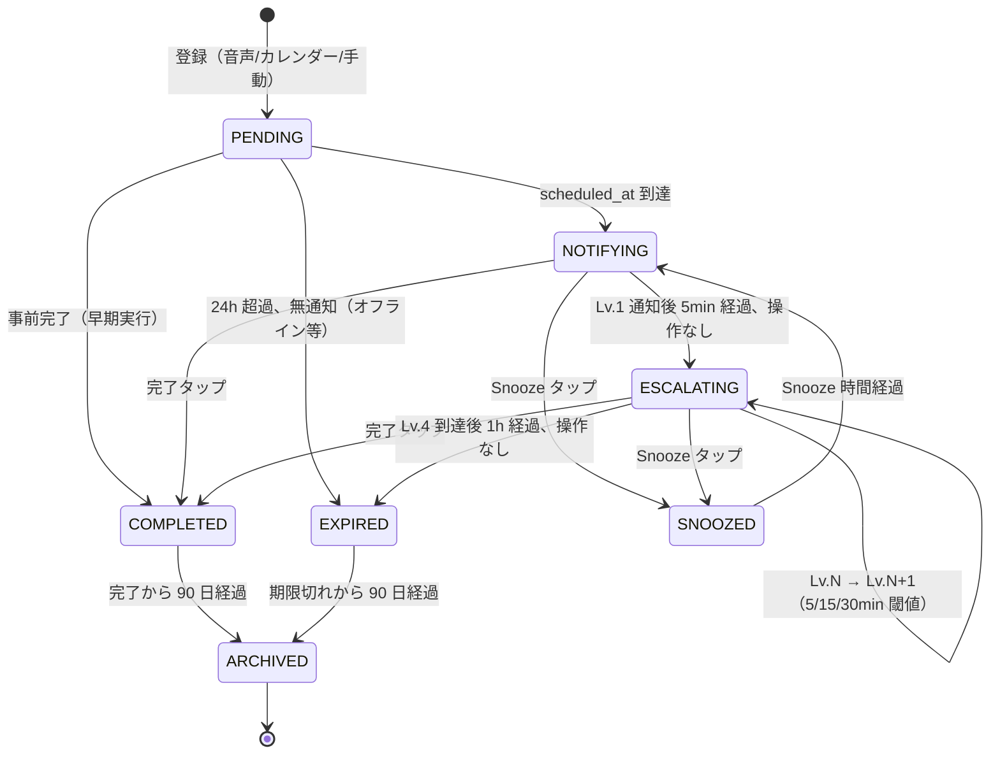
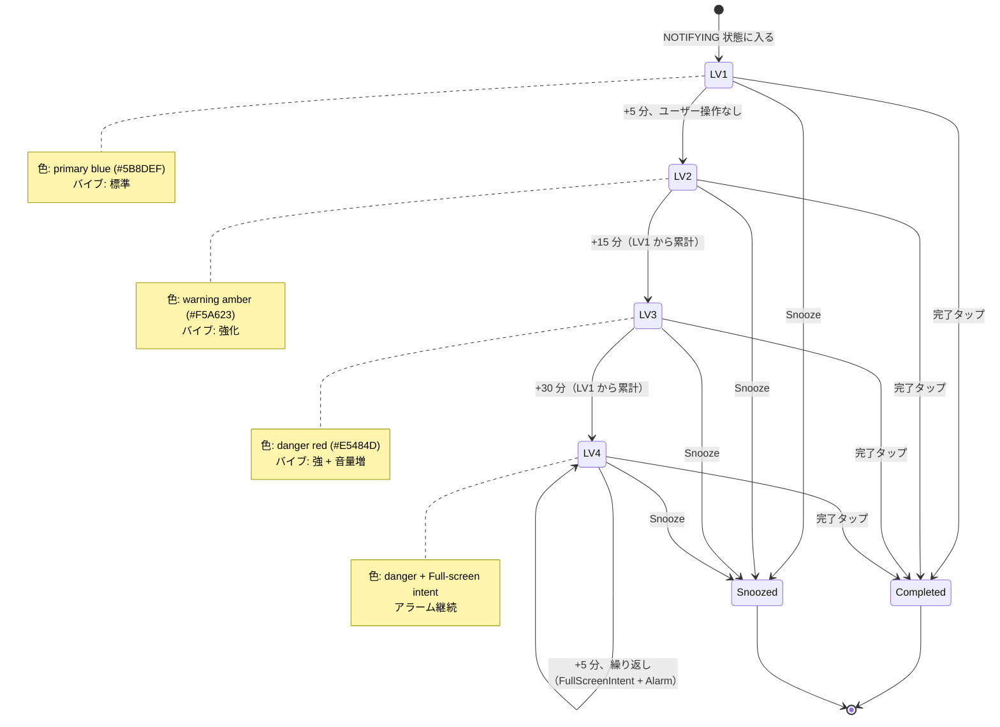
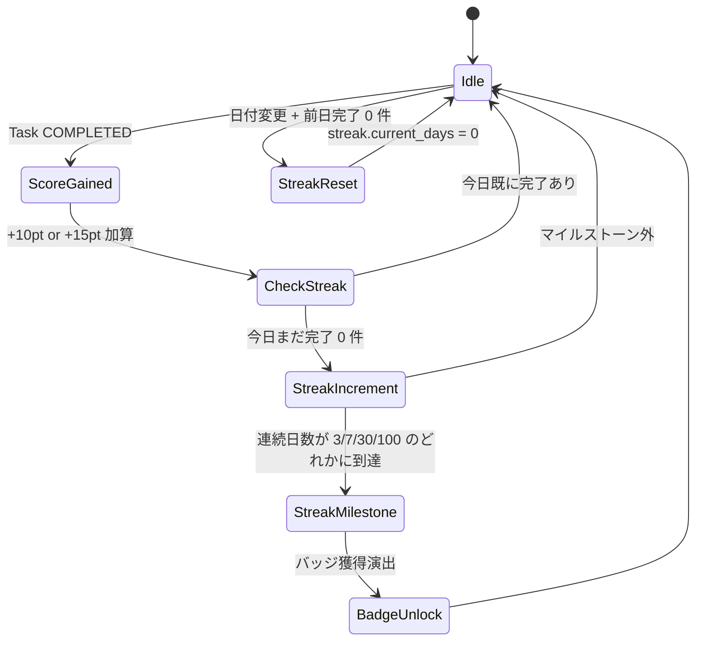
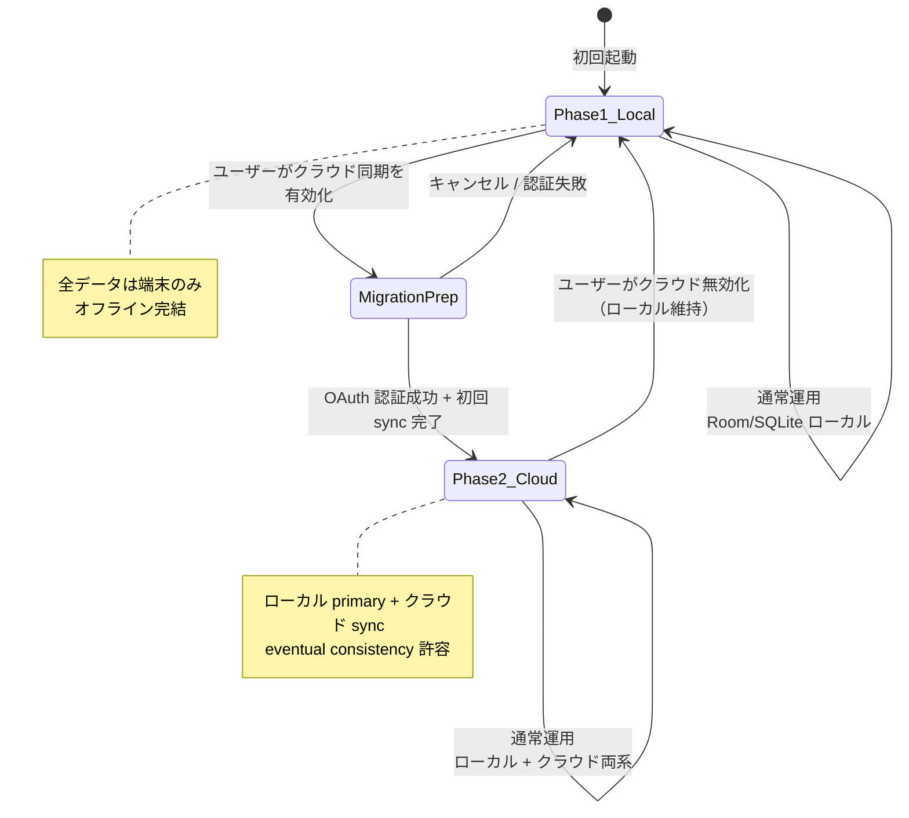

# Hitsuji — 状態遷移図（L0-4 簡易モード）

縮退判断により Mermaid 図のみで記述。XState JSON 機械化は対象外（ADR-001 参照）。

---

## 1. Task 状態遷移

タスクのライフサイクル全体を表す。`TaskStatus` enum と一致。



### 不変条件（本図に対応するもの）

- `COMPLETED` から `NOTIFYING` への戻りは**禁止**（完了したものを再通知しない）
- `ARCHIVED` から他状態への戻りは**禁止**（履歴は不変）
- `ESCALATING` から `PENDING` への戻りは**禁止**（時間軸の単調性）

---

## 2. 通知エスカレーション段階遷移

`NotificationState.current_level` の遷移。F3 機能と直結。



### タスクごとの最大段階制限

`Task.escalation_max` で Lv.1〜Lv.4 を選択可能。
例：軽微な習慣タスク → Lv.2 で停止 / 服薬通知 → Lv.4 まで。

### 不変条件

- 段階は**単調増加**のみ（LV3 → LV2 への降格は禁止）
- `Snooze` 後に `NOTIFYING` に戻る際、`current_level` は **LV1 から再開**（リセット仕様）
- `Task.escalation_max` を超える段階には到達できない

---

## 3. 入力ソース → タスク化フロー

`TaskSource` enum 別の登録経路。

```mermaid
flowchart TD
    VOICE[音声入力<br/>SpeechRecognizer] --> NLP[NLP パース<br/>"明日10時 薬"]
    CAL[Google Calendar<br/>CalendarContract] --> NORMALIZE[正規化]
    MSG[通知リスナー<br/>LINE/メッセージ] -.MVP外.-> NORMALIZE
    MAIL[Gmail API] -.MVP外.-> NORMALIZE
    MANUAL[手動 1 タップ<br/>FAB] --> NORMALIZE

    NLP --> NORMALIZE
    NORMALIZE --> TASK[Task 生成<br/>UUID + scheduled_at]
    TASK --> SCHEDULE[AlarmManager.setExactAndAllowWhileIdle]
    SCHEDULE --> NOTIFY[通知発火]
```

### 不変条件

- すべての入力経路は最終的に **同一の Task entity** に正規化される（`source` で由来は記録）
- 重複検知：同一 `title` + `scheduled_at` ±1 分以内は **マージ**

---

## 4. ゲーミフィケーション状態（Score + Streak）



### 不変条件

- 1 タスク完了で**スコアは 1 回のみ**加算（重複加算禁止）
- 連続日数は **1 日 1 回のみ**増加（同日 2 件完了でも +1）
- マイルストーン到達時のバッジは**冪等**（重複バッジ生成禁止）

---

## 5. データフェーズ移行（Phase 1 → Phase 2）



### 不変条件

- フェーズ移行は**ユーザー明示操作**のみ（自動移行禁止）
- ローカル data は移行後も**消えない**（クラウドはミラー）
- Phase 2 → Phase 1 ダウングレード時、ローカルデータは保持
