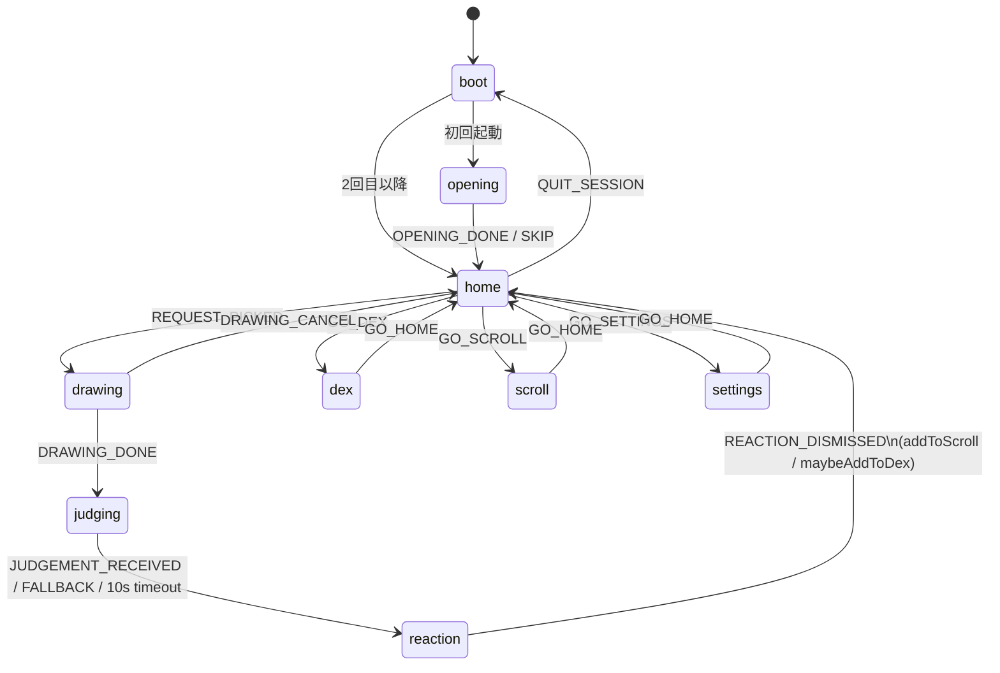
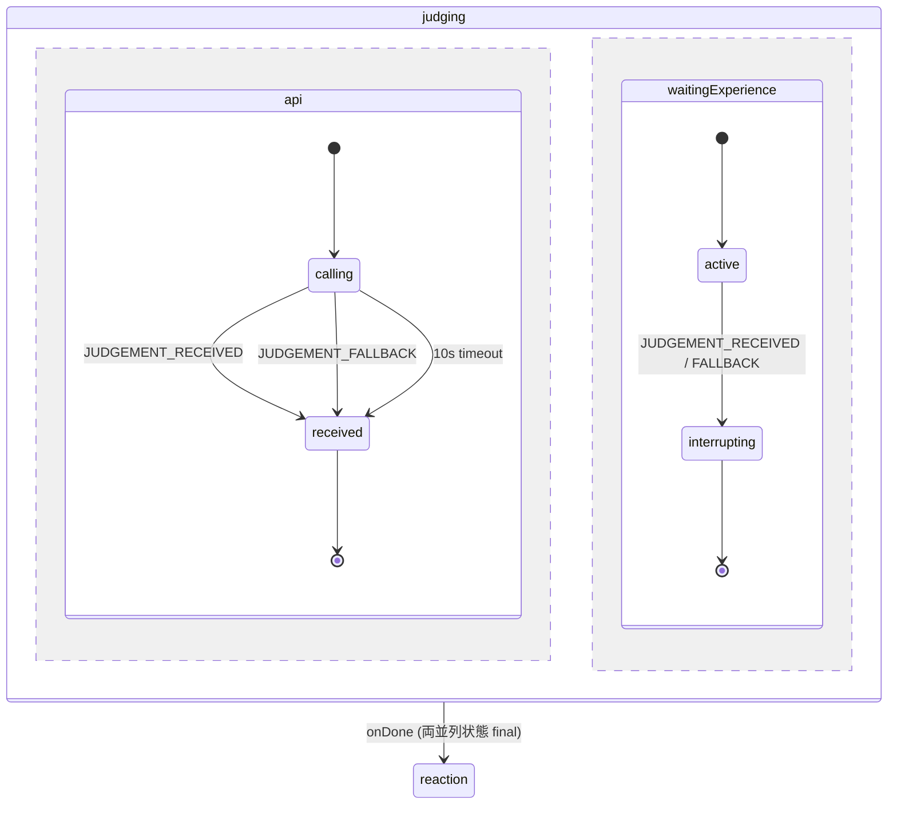
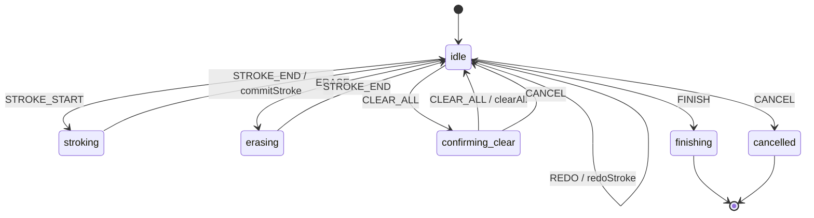
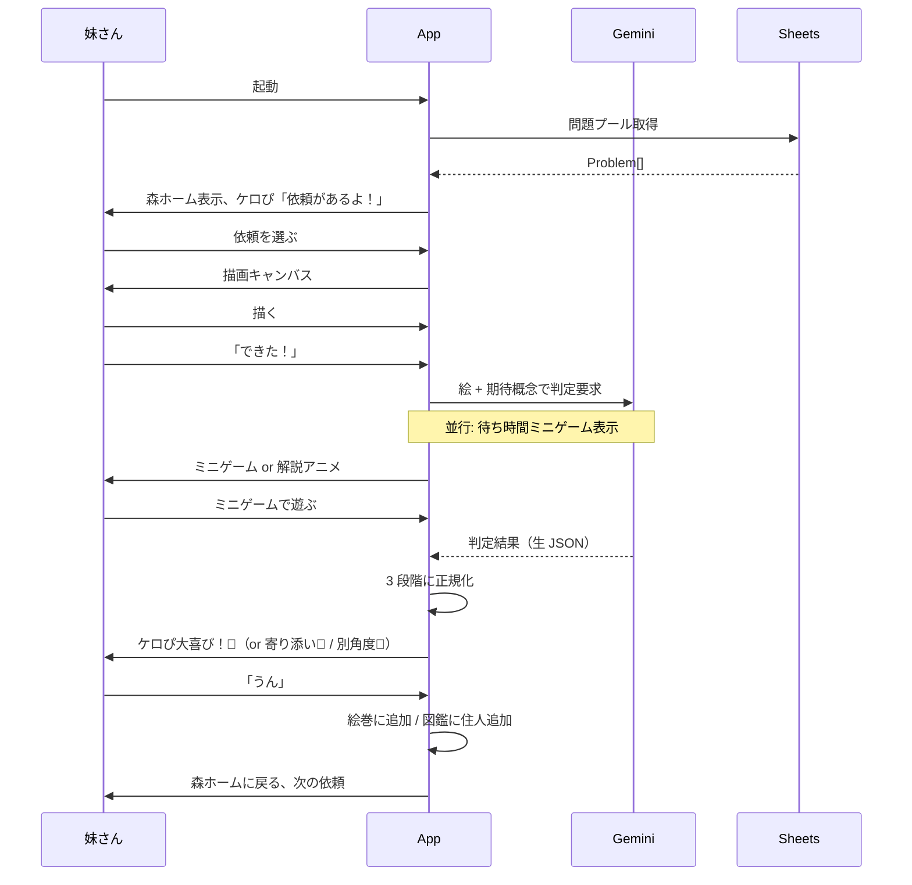
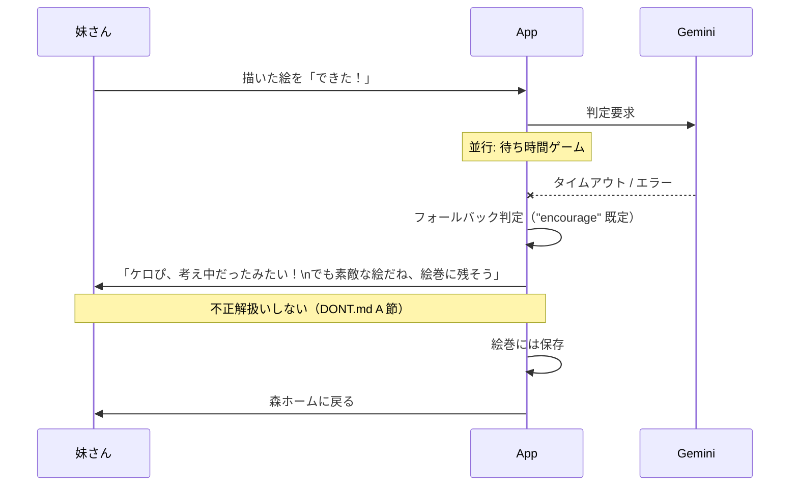

# spec/state-diagrams.md — 状態遷移図（Mermaid）

`spec/state-machine.ts` の図解。実装と図の整合は L1 が責任を持つ。

## トップレベル状態機械

## judging（並列状態 — 重要）

**重要不変**: `waitingExperience` が走らずに `reaction` に遷移するパスは存在しない。
SPEC.md F6（待ち時間も体験）と DONT.md A 節の哲学を満たすため、両並列状態の同時 final が必須。

## 描画キャンバス サブステート

**重要不変**:
- いつでも CANCEL で home に戻れる（DONT.md C 節「戻る常時可能」）
- `confirming_clear` は強制ではなく優しい確認（CANCEL でキャンセル可能）

## ハッピーパス（妹さん視点）

## サッドパス（API 失敗）

